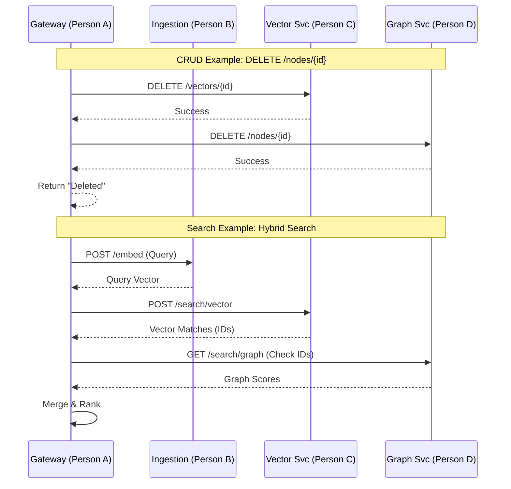

# Vector + Graph Native Database - Architecture Discussion (4-Person Team)

## 1. Microservice Stacks & Endpoints Summary

We have ensured **ALL** endpoints from the problem statement are covered. The **Gateway** exposes the public API and coordinates with the downstream services.

| Service Name | Owner | Tech Stack | Endpoints Managed | Purpose |
| :--- | :--- | :--- | :--- | :--- |
| **1. Gateway Service** | **Person A** | **Python (FastAPI)** | **Node CRUD**: `POST /nodes` `GET /nodes/{id}` `PUT /nodes/{id}` `DELETE /nodes/{id}`  **Edge CRUD**: `POST /edges` `GET /edges/{id}`  **Search**: `POST /search/hybrid` `POST /search/vector` `GET /search/graph`  **Ingest**: `POST /ingest/file` | **The Orchestrator**. Exposes the **Full Public API**. Coordinates "Dual-Write" and "Dual-Delete" to ensure Vector and Graph consistency. Implements Hybrid Ranking. |
| **2. Ingestion Service** | **Person B** | **Python (FastAPI)** `sentence-transformers` `PyPDF2` | `POST /process/text` `POST /process/file` `POST /embed` | **The Processor**. Stateless worker for parsing text/PDFs and generating embeddings. |
| **3. Vector Service** | **Person C** | **Python (FastAPI)** `qdrant-client` | `POST /vectors` (Upsert) `DELETE /vectors/{id}` `POST /search/vector` | **The Vector Specialist**. Wraps **Qdrant**. Handles vector storage and similarity search. |
| **4. Graph Service** | **Person D** | **Python (FastAPI)** `neo4j-driver` | **Node CRUD**: `POST /nodes` `GET /nodes/{id}` `PUT /nodes/{id}` `DELETE /nodes/{id}`  **Edge CRUD**: `POST /edges` `GET /edges/{id}`  **Traversal**: `GET /search/graph` | **The Graph Specialist**. Wraps **Neo4j**. Handles the structural data, relationships, and graph traversals. |

---

## 2. Detailed Workflow Example

### Scenario 1: "Create a Node (CRUD)"
*   **User** calls `POST /nodes` with `{ "text": "AI is great", "metadata": {...} }`.
*   **Gateway (Person A)**:
    1.  Calls **Ingestion (Person B)** `POST /embed` to get vector.
    2.  Calls **Vector Service (Person C)** `POST /vectors` to save vector.
    3.  Calls **Graph Service (Person D)** `POST /nodes` to save metadata/relationships.
    4.  Returns "Node Created".

### Scenario 2: "Upload a PDF (Ingestion)"
1.  **User** uploads `research.pdf` to **Gateway** (`POST /ingest/file`).
2.  **Gateway** sends file to **Ingestion (Person B)** (`POST /process/file`).
3.  **Ingestion** returns chunks + vectors.
4.  **Gateway** performs **Dual Write**:
    *   Calls **Vector Service (Person C)** `POST /vectors` (Batch).
    *   Calls **Graph Service (Person D)** `POST /nodes` (Batch).
5.  **Gateway** returns success.

### Scenario 3: "Hybrid Search"
1.  **User** calls `POST /search/hybrid` with query "What is RAG?".
2.  **Gateway** calls **Ingestion** to get query vector.
3.  **Gateway** calls **Vector Service** (`POST /search/vector`) -> Gets top 10 matches (IDs).
4.  **Gateway** calls **Graph Service** (`GET /search/graph`) -> Gets graph connectivity for those IDs.
5.  **Gateway** merges scores: `Final = (Vector * 0.5) + (Graph * 0.5)`.
6.  **Gateway** returns ranked results.

---

## 3. Visual Flow Diagram

